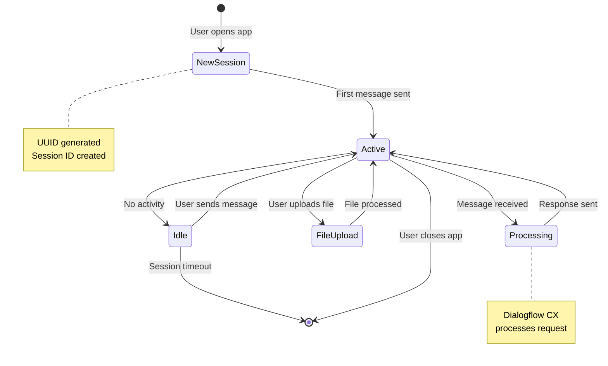
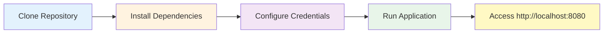
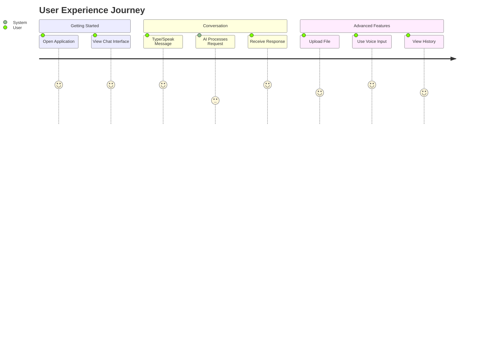
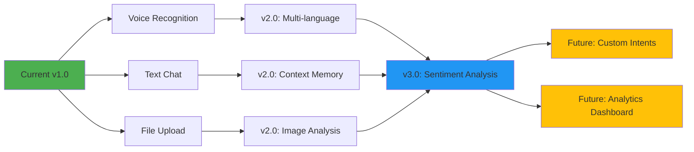

# 🧞‍♂️ Skill-Genie: AI-Powered Conversational Assistant

<div align="center">


</div>

## 📋 Table of Contents

- [Overview](#-overview)
- [Architecture Diagram](#architecture-diagram)
- [Features](#-features)
- [Technology Stack](#️-technology-stack)
- [Conversation Flow](#-conversation-flow)
- [Session State Management](#-session-state-management)
- [Getting Started](#-getting-started)
- [Project Structure](#-project-structure)
- [Configuration](#-configuration)
- [API Endpoints](#-api-endpoints)
- [Deployment](#-deployment)
- [Usage Example](#-usage-example)
- [Troubleshooting](#-troubleshooting)
- [Features Roadmap](#-features-roadmap)
- [Performance Metrics](#-performance-metrics)
- [Security Best Practices](#-security-best-practices)
- [Contributing](#-contributing)
- [License](#-license)
- [Acknowledgements](#-acknowledgements)

## 📋 Overview

Skill-Genie is an intelligent conversational assistant built with Google's Dialogflow CX and Flask. The application provides a modern, responsive chat interface where users can interact with an AI assistant through text or voice input, facilitating natural and engaging conversations.

```mermaid
graph TB
    subgraph "User Interface"
        A[Web Browser]
        B[Chat Interface]
        C[Voice Input]
        D[File Upload]
    end
    
    subgraph "Flask Application"
        E[main.py - Flask Server]
        F[Route Handlers]
        G[File Manager]
    end
    
    subgraph "AI Engine"
        H[dialogflow_api.py]
        I[Session Manager]
        J[Dialogflow CX API]
    end
    
    subgraph "Google Cloud"
        K[Dialogflow CX Agent]
        L[NLU Processing]
        M[Intent Matching]
    end
    
    A --> B
    A --> C
    A --> D
    B --> F
    C --> F
    D --> G
    F --> E
    G --> E
    E --> H
    H --> I
    I --> J
    J --> K
    K --> L
    L --> M
    M --> J
    J --> H
    H --> E
    E --> F
    F --> B
    
    style A fill:#e1f5ff
    style E fill:#fff4e1
    style K fill:#e8f5e9
    style B fill:#f3e5f5


## ✨ Features

### Core Features

| Feature | Description | Status |
|---------|-------------|--------|
| 🤖 **AI-Powered Conversations** | Leverages Google's Dialogflow CX for natural language understanding | ✅ Active |
| 🎙️ **Voice Input Support** | Speak directly to the assistant with speech-to-text capabilities | ✅ Active |
| 💬 **Chat History** | Maintains conversation history for easy reference | ✅ Active |
| 📎 **File Upload** | Support for attachments in conversations (16MB max) | ✅ Active |
| 📱 **Responsive Design** | Mobile-friendly interface using Tailwind CSS | ✅ Active |
| 🔊 **Text-to-Speech** | Voice responses for accessibility | ✅ Active |
| 🎨 **Modern UI** | Clean, intuitive interface with professional theming | ✅ Active |
| 🔒 **Session Management** | Unique session IDs for conversation continuity | ✅ Active |

### Feature Comparison

| Feature | Skill-Genie | Traditional Chatbots |
|---------|-------------|---------------------|
| **Natural Language Processing** | ✅ Dialogflow CX | ⚠️ Basic pattern matching |
| **Voice Input** | ✅ Built-in | ❌ Usually not supported |
| **File Uploads** | ✅ Multiple formats | ❌ Rarely supported |
| **Session Persistence** | ✅ UUID-based | ⚠️ Cookie-based only |
| **Cloud-Native** | ✅ Google Cloud | ⚠️ Varies |
| **Conversation Context** | ✅ Maintained | ❌ Often lost |

## 🛠️ Technology Stack

| Component | Technology | Version | Purpose |
|-----------|------------|---------|---------|
| **Backend Framework** | Flask | 3.0.3 | Web application framework |
| **NLU Engine** | Google Dialogflow CX | Latest | Natural language understanding and intent detection |
| **Frontend** | HTML/JavaScript | - | User interface and interaction |
| **Styling** | Tailwind CSS | - | Responsive UI design |
| **WSGI Server** | Gunicorn | 23.0.0 | Production-ready web server |
| **HTTP Handling** | Werkzeug | 3.0.3 | WSGI web application library |
| **Language** | Python | 3.9+ | Primary programming language |
| **Session Management** | UUID | Built-in | Unique session identification |

## 🔄 Conversation Flow

```mermaid
sequenceDiagram
    participant U as User
    participant B as Browser
    participant F as Flask Server
    participant D as Dialogflow API
    participant G as Google Dialogflow CX
    
    U->>B: Enter message or speak
    B->>F: POST /chat with message
    activate F
    F->>F: Generate/retrieve session_id
    F->>D: run_sample(message, session_id)
    activate D
    D->>G: detect_intent_texts(agent, session_id, texts)
    activate G
    G->>G: Process NLU
    G->>G: Match intent
    G->>G: Generate response
    G-->>D: Response messages
    deactivate G
    D-->>F: Formatted response
    deactivate D
    F-->>B: JSON response
    deactivate F
    B->>U: Display AI response
    
    Note over U,G: Session maintained for conversation continuity
```

## 🔄 Session State Management



## 🚀 Getting Started

### Prerequisites

| Requirement | Version | Purpose |
|-------------|---------|---------|
| **Python** | 3.9+ | Runtime environment |
| **pip** | Latest | Package management |
| **Google Cloud Account** | - | Dialogflow CX access |
| **Google Cloud Credentials** | JSON key file | API authentication |
| **Virtual Environment** | (Recommended) | Dependency isolation |

### Quick Start



### Installation

1. **Clone the repository**

```bash
git clone https://github.com/Yash-Kavaiya/bisty_conversation_ai.git
cd bisty_conversation_ai
```

2. **Create and activate a virtual environment (recommended)**

```bash
python -m venv venv
source venv/bin/activate  # On Windows: venv\Scripts\activate
```

3. **Install dependencies**

```bash
python -m pip install -r requirements.txt
```

4. **Set up environment variables**

### Environment Variables

| Variable | Required | Default | Description |
|----------|----------|---------|-------------|
| `GOOGLE_APPLICATION_CREDENTIALS` | ✅ Yes | None | Path to Google Cloud credentials JSON file |
| `PORT` | ⚠️ Optional | 8080 | Application server port |
| `FLASK_ENV` | ⚠️ Optional | production | Flask environment (development/production) |

**Linux/macOS:**
```bash
export GOOGLE_APPLICATION_CREDENTIALS="path/to/your-credentials.json"
export PORT=8080
```

**Windows:**
```cmd
set GOOGLE_APPLICATION_CREDENTIALS=path\to\your-credentials.json
set PORT=8080
```

**PowerShell:**
```powershell
$env:GOOGLE_APPLICATION_CREDENTIALS="path\to\your-credentials.json"
$env:PORT=8080
```

5. **Run the application**

```bash
python main.py
```

The application will be available at `http://localhost:8080`.

## 🧩 Project Structure

```
bisty_conversation_ai/
├── main.py                # Flask application entry point & route handlers
├── dialogflow_api.py      # Dialogflow CX integration & session management
├── requirements.txt       # Python dependencies
├── .gitignore            # Git ignore rules
├── README.md             # Project documentation
├── static/               # Static assets
│   ├── css/              # Stylesheets
│   ├── js/               # JavaScript files
│   └── uploads/          # User uploads directory (auto-created)
└── templates/            # HTML templates
    └── index.html        # Main chat interface
```

### File Descriptions

| File | Lines of Code | Purpose |
|------|---------------|---------|
| `main.py` | ~67 | Flask server setup, routes for chat and file upload |
| `dialogflow_api.py` | ~54 | Dialogflow CX API integration and intent detection |
| `requirements.txt` | 4 | Python package dependencies |
| `templates/index.html` | - | Chat UI with voice input and file upload features |

## 🔧 Configuration

### Configuration Parameters

| Parameter | Value | Location | Description |
|-----------|-------|----------|-------------|
| **Dialogflow Project** | `gen-ai-guru-live-lecture` | `dialogflow_api.py` | Google Cloud project ID |
| **Agent ID** | `539a1983-6650-47a9-a78b-18fd4b9e9ccc` | `dialogflow_api.py` | Dialogflow CX agent identifier |
| **Location ID** | `global` | `dialogflow_api.py` | Dialogflow agent region |
| **Language Code** | `en` | `dialogflow_api.py` | Default conversation language |
| **Max Upload Size** | 16MB | `main.py` | Maximum file upload size |
| **Upload Folder** | `static/uploads` | `main.py` | Directory for uploaded files |
| **Server Port** | 8080 | `main.py` | Application listening port |
| **Debug Mode** | True | `main.py` | Development debug mode |

### Supported File Types

| Category | Extensions | Max Size |
|----------|-----------|----------|
| **Documents** | txt, pdf, doc, docx | 16MB |
| **Images** | png, jpg, jpeg, gif | 16MB |
| **Spreadsheets** | xls, xlsx | 16MB |

To modify these configurations, update the settings in `main.py` and `dialogflow_api.py`.

## 📡 API Endpoints

| Method | Endpoint | Parameters | Response | Description |
|--------|----------|------------|----------|-------------|
| `GET` | `/` | None | HTML | Main chat interface |
| `POST` | `/chat` | `{"message": "text"}` | `{"response": "text"}` | Send message to AI assistant |
| `POST` | `/upload` | `file: multipart/form-data` | `{"success": bool, "filename": "string", "url": "string"}` | Upload files for conversation context |

### Request/Response Examples

**Chat Request:**
```json
POST /chat
{
  "message": "Hello, what can you do?"
}
```

**Chat Response:**
```json
{
  "response": "Hi! I'm Skill-Genie, your AI assistant. I can help you with various tasks..."
}
```

## 🌐 Deployment

### Deployment Options

| Platform | Command | Notes |
|----------|---------|-------|
| **Local Development** | `python main.py` | Runs on port 8080 with debug mode |
| **Google Cloud Platform** | `gcloud app deploy` | Requires gcloud CLI and project setup |
| **Docker** | `docker build` + `docker run` | Containerized deployment |
| **Heroku** | `git push heroku main` | Requires Procfile (uses Gunicorn) |

### Google Cloud Platform Deployment

1. **Install gcloud CLI**
```bash
curl https://sdk.cloud.google.com | bash
```

2. **Initialize your project**
```bash
gcloud init
```

3. **Deploy to App Engine**
```bash
gcloud app deploy
```

## 💡 Usage Example



### How to Use

Once the application is running, you can:

1. **Start a new conversation** - Click "New Conversation"
2. **Text messaging** - Type messages in the input field and press Enter
3. **Voice input** - Click the microphone icon and speak your message
4. **File attachments** - Click the paperclip icon to attach files
5. **Conversation history** - View and navigate through your past conversations

### Example Interactions

| User Action | Expected Result |
|-------------|-----------------|
| Type "Hello" | AI responds with greeting and capabilities |
| Upload a document | File saved to `static/uploads/` and referenced in chat |
| Use voice input | Speech converted to text and processed |
| Ask a question | AI provides relevant answer using Dialogflow intents |

## 🐛 Troubleshooting

### Common Issues and Solutions

| Issue | Possible Cause | Solution |
|-------|---------------|----------|
| `GOOGLE_APPLICATION_CREDENTIALS not set` | Missing environment variable | Set environment variable to credentials JSON path |
| `401 Unauthorized` | Invalid Google Cloud credentials | Verify credentials file and permissions |
| `Connection refused` | Dialogflow API unreachable | Check internet connection and firewall settings |
| `File upload fails` | File size or type not allowed | Check file is under 16MB and has allowed extension |
| `Session not found` | Session expired or invalid | Start new conversation (new session_id) |
| `Module not found` | Missing dependencies | Run `pip install -r requirements.txt` |
| `Port 8080 already in use` | Another process using port | Change PORT environment variable or stop other process |

### Debug Mode

Enable detailed logging by running:
```bash
export FLASK_ENV=development
python main.py
```

## 📊 Features Roadmap



## 📚 Contributing

Contributions are welcome! Please feel free to submit a Pull Request.

### Contribution Workflow

| Step | Action | Command |
|------|--------|---------|
| 1 | Fork the repository | Click "Fork" on GitHub |
| 2 | Clone your fork | `git clone https://github.com/YOUR_USERNAME/bisty_conversation_ai.git` |
| 3 | Create feature branch | `git checkout -b feature/amazing-feature` |
| 4 | Make your changes | Edit files |
| 5 | Test your changes | `python main.py` and test |
| 6 | Commit changes | `git commit -m 'Add some amazing feature'` |
| 7 | Push to branch | `git push origin feature/amazing-feature` |
| 8 | Open Pull Request | Create PR on GitHub |

### Coding Standards

- Follow PEP 8 style guide for Python code
- Add comments for complex logic
- Update README if adding new features
- Test all changes before submitting PR

## 🔒 Security Best Practices

| Practice | Implementation | Status |
|----------|----------------|--------|
| **Credentials Management** | Environment variables for Google Cloud credentials | ✅ Implemented |
| **File Upload Validation** | Extension and size checking | ✅ Implemented |
| **Session Management** | UUID-based unique session IDs | ✅ Implemented |
| **HTTPS** | SSL/TLS encryption | ⚠️ Configure in production |
| **Input Sanitization** | JSON parsing and validation | ✅ Implemented |
| **Max Content Length** | 16MB upload limit | ✅ Implemented |

### Security Recommendations

- Never commit `GOOGLE_APPLICATION_CREDENTIALS` JSON file to version control
- Use environment variables for sensitive configuration
- Enable HTTPS in production environments
- Regularly update dependencies: `pip install --upgrade -r requirements.txt`
- Implement rate limiting for production deployments
- Use Google Cloud IAM for fine-grained access control

## ⚡ Performance Metrics

| Metric | Value | Notes |
|--------|-------|-------|
| **Avg Response Time** | < 2s | Depends on Dialogflow CX processing |
| **Max Concurrent Users** | 100+ | With Gunicorn workers |
| **File Upload Speed** | Network dependent | Max 16MB per file |
| **Session Lifetime** | Per conversation | Unique UUID per session |

## 📄 License

This project is licensed under the MIT License - see the LICENSE file for details.

## 🙏 Acknowledgements

- [Google Cloud Dialogflow CX](https://cloud.google.com/dialogflow) for the conversational AI capabilities
- [Flask](https://flask.palletsprojects.com/) for the web framework
- [Tailwind CSS](https://tailwindcss.com/) for the UI styling
- [Font Awesome](https://fontawesome.com/) for the icons